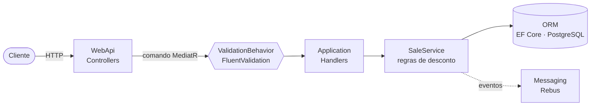

<div align="center">

# 🛒 DeveloperStore · API de Vendas

**API da DeveloperStore: vendas (CRUD completo com regras de desconto e eventos), produtos, carrinhos, usuários e autenticação JWT. Construída com DDD, CQRS e o padrão External Identities.**


[Início rápido](#-início-rápido) •
[Regras de negócio](#-regras-de-negócio) •
[API](#-api) •
[Arquitetura](#%EF%B8%8F-arquitetura) •
[Testes](#-testes) •
[Roadmap](#%EF%B8%8F-roadmap)

</div>

---

## 📌 Sobre

Protótipo da API de vendas da **DeveloperStore**, desenvolvido para o desafio técnico da Ambev. O enunciado original do desafio está na pasta [`.doc/`](.doc/overview.md).

A API registra vendas com:

- 🧾 número e data da venda
- 👤 cliente e 🏬 filial
- 📦 produtos, quantidades, preços unitários, descontos e total por item
- 💰 valor total da venda
- ❌ status de cancelada / não cancelada

### 🔗 External Identities

Cliente, Filial e Produto pertencem a **outros bounded contexts**. O contexto de Vendas nunca faz join com eles. Ele guarda o **id externo** junto com uma **descrição denormalizada**, capturada no momento da venda:

```text
Sale ──┬── CustomerId + CustomerName
       ├── BranchId   + BranchName
       └── Items[] ── ProductId + ProductName
```

---

## 🚀 Início rápido

> **Pré-requisitos:** [Docker](https://www.docker.com/) e, para rodar a API localmente ou executar os testes, o [.NET 8 SDK](https://dotnet.microsoft.com/download/dotnet/8.0).

### 🐳 Opção 1: tudo com Docker (recomendado)

```bash
git clone https://github.com/rodrigoBrandaoDeSouza/backend-challenge.git
cd backend-challenge
docker compose up --build
```

| Serviço | Endereço |
|---|---|
| 📖 Swagger | **http://localhost:8080/swagger** |
| 🐘 PostgreSQL | `localhost:5432` (banco `developer_evaluation`, usuário `developer`) |

✅ As migrations do banco são aplicadas automaticamente quando a API sobe.

### 💻 Opção 2: banco no Docker, API na sua máquina

```bash
docker compose up -d ambev.developerevaluation.database
dotnet run --project src/Ambev.DeveloperEvaluation.WebApi --launch-profile https
```

➡️ Swagger em **https://localhost:7181/swagger** (ou `http://localhost:5119/swagger` com o profile `http`).

<details>
<summary>⚙️ Configuração e migrations manuais</summary>

A connection string fica em `src/Ambev.DeveloperEvaluation.WebApi/appsettings.json`:

```json
"DefaultConnection": "Host=localhost;Port=5432;Database=developer_evaluation;Username=developer;Password=ev@luAt10n;Pooling=true;SSL Mode=Disable;Trust Server Certificate=true"
```

No Docker, ela é sobrescrita pela variável de ambiente `ConnectionStrings__DefaultConnection` (veja o `docker-compose.yml`).

Para aplicar as migrations manualmente:

```bash
dotnet tool install --global dotnet-ef
dotnet ef database update \
  --project src/Ambev.DeveloperEvaluation.ORM \
  --startup-project src/Ambev.DeveloperEvaluation.WebApi
```

</details>

---

## 📐 Regras de negócio

O desconto é calculado por **item idêntico**: linhas com o mesmo `productId`, somando as quantidades.

| Itens idênticos | Desconto | Observação |
|:---:|:---:|:---|
| 1 – 3 | **0%** | compras com menos de 4 itens não têm desconto |
| 4 – 9 | **10%** | |
| 10 – 20 | **20%** | |
| > 20 | 🚫 | não permitido, a API retorna erro de validação |

```text
item.totalPrice  = quantity × unitPrice × (1 − desconto)
sale.totalAmount = Σ item.totalPrice
```

> 💡 Os totais enviados pelo cliente são ignorados. A API sempre recalcula.

---

## 📡 API

Todas as rotas ficam sob **`/api`** e seguem as definições da pasta [`.doc/`](../../.doc/general-api.md).

### 🔐 Autenticação

1. Cadastre um usuário: `POST /api/users` (público)
2. Faça login: `POST /api/auth/login` → `{ "token": "..." }`
3. Envie o token no header `Authorization: Bearer {token}` (no Swagger, use o botão **Authorize**)

São públicos: login, cadastro de usuário e a leitura do catálogo de produtos. O restante exige token.

### Rotas

| Recurso | Método | Rota | Descrição |
|---|:---:|---|---|
| **Auth** | POST | `/api/auth/login` | Autentica e devolve o JWT |
| **Sales** | GET | `/api/sales` | Lista vendas (paginação, ordenação e filtros) |
| | GET | `/api/sales/{id}` | Busca uma venda |
| | POST | `/api/sales` | Cria uma venda |
| | PUT | `/api/sales/{id}` | Atualiza uma venda |
| | DELETE | `/api/sales/{id}` | Exclui uma venda |
| | PATCH | `/api/sales/{id}/cancel` | Cancela a venda |
| | PATCH | `/api/sales/{id}/items/{itemId}/cancel` | Cancela um item da venda |
| **Products** | GET | `/api/products` | Lista produtos |
| | GET | `/api/products/{id}` | Busca um produto |
| | GET | `/api/products/categories` | Lista as categorias |
| | GET | `/api/products/category/{category}` | Lista os produtos de uma categoria |
| | POST / PUT / DELETE | `/api/products[/{id}]` | Cria, atualiza e exclui produtos |
| **Carts** | GET / POST | `/api/carts` | Lista e cria carrinhos |
| | GET / PUT / DELETE | `/api/carts/{id}` | Busca, atualiza e exclui um carrinho |
| **Users** | GET / POST | `/api/users` | Lista e cadastra usuários |
| | GET / PUT / DELETE | `/api/users/{id}` | Busca, atualiza e exclui um usuário |

### 🔎 Paginação, ordenação e filtros

Válido para todas as listagens:

```http
GET /api/products?_page=2&_size=20&_order="price desc, title asc"
GET /api/products?title=Fjallraven*&category=men's clothing&_minPrice=50&_maxPrice=200
GET /api/sales?customerName=Bar*&cancelled=false&_minDate=2025-01-01
```

- `_page` (padrão 1) e `_size` (padrão 10, máximo 100)
- `_order`: campos no mesmo formato do JSON de resposta, `asc` (padrão) ou `desc`; campos aninhados com ponto (`rating.rate desc`)
- `campo=valor`: igualdade; em textos, `*` no início/fim faz busca parcial (sem diferenciar maiúsculas)
- `_minCampo` / `_maxCampo`: faixas para números e datas
- o mesmo campo informado mais de uma vez é combinado com **OU**; campos diferentes, com **E**

Resposta das listagens:

```json
{ "data": [ ... ], "totalItems": 42, "currentPage": 1, "totalPages": 5 }
```

### ❗ Formato de erro

```json
{ "type": "ResourceNotFound", "error": "Sale not found", "detail": "The sale with ID ... does not exist in our database" }
```

| HTTP | `type` | Quando |
|:---:|---|---|
| 400 | `ValidationError` | dados inválidos, JSON malformado, parâmetros de listagem inválidos |
| 400 | `BusinessRuleViolation` | regra de negócio violada (ex.: alterar venda cancelada) |
| 401 | `AuthenticationError` | token ausente/inválido ou credenciais inválidas |
| 404 | `ResourceNotFound` | recurso inexistente |
| 409 | `ResourceConflict` | valor único duplicado (número da venda, e-mail, username) |
| 500 | `InternalServerError` | erro inesperado |

### ✍️ Exemplo: criar uma venda

```http
POST /api/sales
Authorization: Bearer {token}
Content-Type: application/json

{
  "saleNumber": "S-0001",
  "date": "2025-10-20T14:30:00Z",
  "customerId": "6f1c2a4e-0000-4000-8000-000000000001",
  "customerName": "Bar do Zé",
  "branchId": "6f1c2a4e-0000-4000-8000-0000000000b1",
  "branchName": "Filial Toledo",
  "items": [
    { "productId": "6f1c2a4e-0000-4000-8000-0000000000a1", "productName": "Cerveja 600ml",   "quantity": 12, "unitPrice": 9.90 },
    { "productId": "6f1c2a4e-0000-4000-8000-0000000000a2", "productName": "Refrigerante 2L", "quantity": 2,  "unitPrice": 11.50 }
  ]
}
```

Resultado:

| Produto | Qtd | Preço unitário | Desconto | Total do item |
|---|:---:|---:|:---:|---:|
| Cerveja 600ml | 12 | 9,90 | 20% | **95,04** |
| Refrigerante 2L | 2 | 11,50 | 0% | **23,00** |
| | | | **Total da venda** | **118,04** |

### 🔄 Atualização e cancelamento

- `date` não informada → mantém a data original da venda
- item **com** `id` → é atualizado; item **sem** `id` → é adicionado; item que não veio no payload → é removido
- cancelar um item recalcula descontos e total (itens cancelados não entram na conta)
- venda cancelada não pode ser alterada nem cancelada de novo

📂 Há requisições prontas (com login) no arquivo [`Ambev.DeveloperEvaluation.WebApi.http`](src/Ambev.DeveloperEvaluation.WebApi/Ambev.DeveloperEvaluation.WebApi.http), que funciona no Visual Studio e no REST Client do VS Code.

### 📣 Eventos de domínio

Os eventos são publicados com **Rebus** usando o transporte em memória, então não é preciso um message broker: um handler consome os eventos e registra no log da aplicação. Trocar para RabbitMQ/Azure Service Bus é só configuração em `MessagingConfiguration`.

| Evento | Publicado quando |
|---|---|
| `SaleCreatedEvent` | uma venda é criada |
| `SaleModifiedEvent` | uma venda é alterada |
| `SaleCancelledEvent` | uma venda é cancelada |
| `ItemCancelledEvent` | um item da venda é cancelado |
| `SaleDeletedEvent` | uma venda é excluída |

---

## 🏛️ Arquitetura



| Camada | Responsabilidade |
|---|---|
| **WebApi** | Controllers, middleware de erros, paginação, `Program` |
| **Application** | Commands/queries e handlers (CQRS), validadores, profiles do AutoMapper, parser de paginação/filtros, `SaleService` |
| **Domain** | Entidades (`Sale`, `SaleItem`, `Product`, `Cart`, `User`), value objects, regras de desconto, exceções e contratos |
| **ORM** | `DefaultContext`, mapeamentos, migrations, repositórios e filtros/ordenação dinâmicos |
| **Messaging** | Eventos de domínio, publisher e handlers (Rebus) |
| **IoC** | Módulos de injeção de dependência |
| **Common** | Pipeline de validação, logging (Serilog), JWT e hash de senha (BCrypt) |

<details>
<summary>📁 Estrutura de pastas</summary>

```text
root
├── .doc/                                    # documentação do desafio
├── src/
│   ├── Ambev.DeveloperEvaluation.WebApi
│   ├── Ambev.DeveloperEvaluation.Application
│   ├── Ambev.DeveloperEvaluation.Domain
│   ├── Ambev.DeveloperEvaluation.ORM
│   ├── Ambev.DeveloperEvaluation.Messaging
│   ├── Ambev.DeveloperEvaluation.IoC
│   └── Ambev.DeveloperEvaluation.Common
├── tests/
│   ├── Ambev.DeveloperEvaluation.Unit
│   ├── Ambev.DeveloperEvaluation.Integration
│   └── Ambev.DeveloperEvaluation.Functional
├── docker-compose.yml
├── Dockerfile
└── Ambev.DeveloperEvaluation.sln
```

</details>

### 🧰 Tecnologias

| Área | Tecnologias |
|---|---|
| **Runtime** | .NET 8 · ASP.NET Core Web API · Swagger |
| **Dados** | EF Core 8 · Npgsql · PostgreSQL 13 |
| **Padrões** | DDD · CQRS com MediatR · External Identities · Repository |
| **Bibliotecas** | MediatR · AutoMapper · FluentValidation · Rebus · Serilog · BCrypt · JWT |
| **Testes** | xUnit · NSubstitute · Bogus · FluentAssertions · EF Core InMemory · WebApplicationFactory · Coverlet |
| **Infra** | Docker · Docker Compose |

---

## 🧪 Testes

```bash
dotnet test Ambev.DeveloperEvaluation.sln
```

📊 Relatório de cobertura, gerado em `TestResults/CoverageReport/index.html`:

```bash
./coverage-report.sh     # Linux / macOS
coverage-report.bat      # Windows
```

| Projeto | O que cobre |
|---|---|
| **Unit** | regras de desconto e limite de 20 itens, cancelamentos, handlers, `SaleService` e eventos, validadores, parser de paginação/filtros, JWT/BCrypt, configuração do AutoMapper (NSubstitute + Bogus) |
| **Integration** | repositórios com EF Core InMemory: filtros com curinga, faixas `_min`/`_max`, ordenação por campo aninhado, sincronização de itens |
| **Functional** | API completa via `WebApplicationFactory`: ciclo de vida da venda, autenticação, formato de erro, paginação, produtos, carrinhos e usuários |

---

## 🗺️ Roadmap

- [x] Endpoints para cancelar a venda e um item específico, publicando `SaleCancelled` e `ItemCancelled`
- [x] Desconsiderar itens cancelados nos totais e descontos
- [x] DTOs de resposta em vez de expor as entidades de domínio; `404` no `GET /api/sales/{id}`
- [x] Products, Carts, Users e Auth conforme a pasta `.doc/`
- [x] Paginação, ordenação e filtros padronizados (`_page`, `_size`, `_order`, `*`, `_min`/`_max`)
- [ ] Testes de integração com PostgreSQL real (Testcontainers)
- [ ] Autorização por perfil (Customer / Manager / Admin)
- [ ] MongoDB (citado na stack do desafio) — hoje todos os recursos usam PostgreSQL
- [ ] CI com GitHub Actions (build + testes)

---

<div align="center">

Desenvolvido por **Rodrigo Brandão** · 📍 Toledo, PR

[](https://www.linkedin.com/in/brandao-rodrigo/)

</div>
